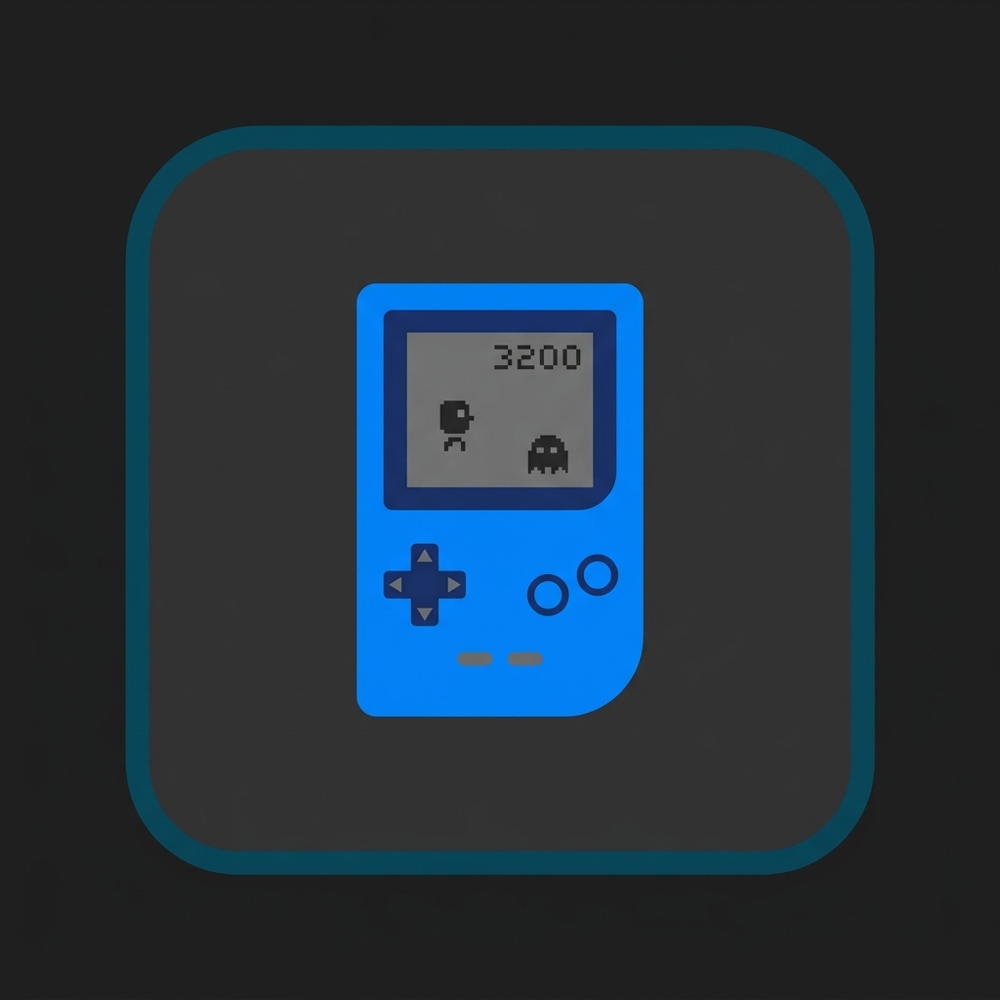

  
  <h1>🎮 PSP ISO Compressor (ZSO & CSO)</h1>
  
<i>A simple, drag-and-drop utility for Mac and Windows that compresses massive PSP <code>.ISO</code> backups into highly optimized <code>.ZSO</code> or <code>.CSO</code> files.</i>

---

## 🚀 Features & Formats

This tool explicitly provides conversion paths tailored for your specific gaming setup:
- **ISO ➔ CSO**
- **CSO ➔ ZSO**
- **ISO ➔ ZSO**

### 🖥️ Why CSO is better for PPSSPP
If you are playing your PSP games on the **PPSSPP Emulator** (on a PC, Mac, or phone), you should ALWAYS use the **CSO** format. An uncompressed `.ISO` file wastes gigabytes of storage space with blank "dummy data". The `.CSO` format uses standard Zlib compression to aggressively shrink the file down. Because modern PCs and smartphones have massive processing power, the emulator can decompress the CSO file instantly in the background, giving you massive storage savings with absolutely zero performance loss. 
*(Note: PPSSPP does not currently support the ZSO format).*

### 🕹️ Why ZSO is better for Real PSP Hardware
If you are playing games on **Real Physical PSP Hardware** (running ARK-5 Custom Firmware), you should ALWAYS use the **ZSO** format. 
Back in the day, people used CSO files on real PSPs to save space. However, because Zlib compression is so tight, the extremely weak 333MHz PSP processor would choke trying to decompress the game files fast enough, causing terrible lag spikes and audio stuttering (especially in games like *Grand Theft Auto*). 
The `.ZSO` format fixes this by using ultra-fast **LZ4 compression**. It shrinks the game beautifully, but decompresses roughly **500% faster**. This allows the physical PSP to unpack the game instantly, completely curing the lag spikes while still saving you massive amounts of space on your memory stick!

---

## 🍏 How to use (Mac)
1. Download the latest Mac Release from the Releases tab.
2. Open **`ISO Compressor (Mac).app`** by double-clicking it, or simply **drag-and-drop** your `.ISO`/`.CSO` files directly onto the app icon.
3. A prompt will clearly ask you to choose between CSO (For PPSSPP) or ZSO (For Real Hardware).
4. The app will compress the file in the background and place the new game in the exact same folder as your original game.

## 🪟 How to use (Windows)
1. Download the latest Windows Release from the Releases tab and extract the folder.
2. **Drag and drop** your `.ISO`/`.CSO` files directly onto the `Drag and Drop Games Here.bat` script file.
3. A command window will prompt you to select your conversion path (Type `1` or `2`).
4. The script will shrink the games and place the new files right next to your originals.

---

## ⚖️ License & Open Source
This project is licensed under the [MIT License](LICENSE). 
* **maxcso Engine:** All core compression credit goes to [unknownbrackets](https://github.com/unknownbrackets/maxcso) for creating the blazing fast C++ compression engine used under the hood of this tool.
* **ARK-5 Custom Firmware:** Massive thanks to the [ARK-5 Team](https://github.com/PSP-Archive/ARK-4) (Acid_Snake, KrazyS, and contributors) for modernizing the PSP scene and building native ZSO (Inferno V2) support directly into the firmware, which makes this entire project possible!
